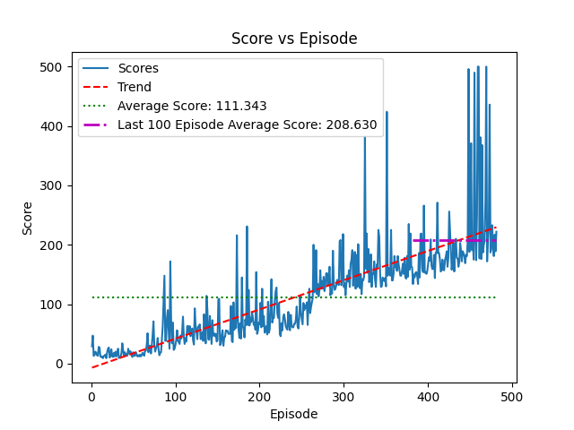

# OpenAIGymDiscrete

Solving the CartPole-v1 problem using Deep Q-Learning

<figure style="display: block;"">
    
    <p><figcaption>Trained on 481 episodes in 1 day, 1 hour,  6 minutes, and 47 seconds</figcaption></p>
</figure>

## Installation
```
pip install gym tensorflow numpy matplotlib
```